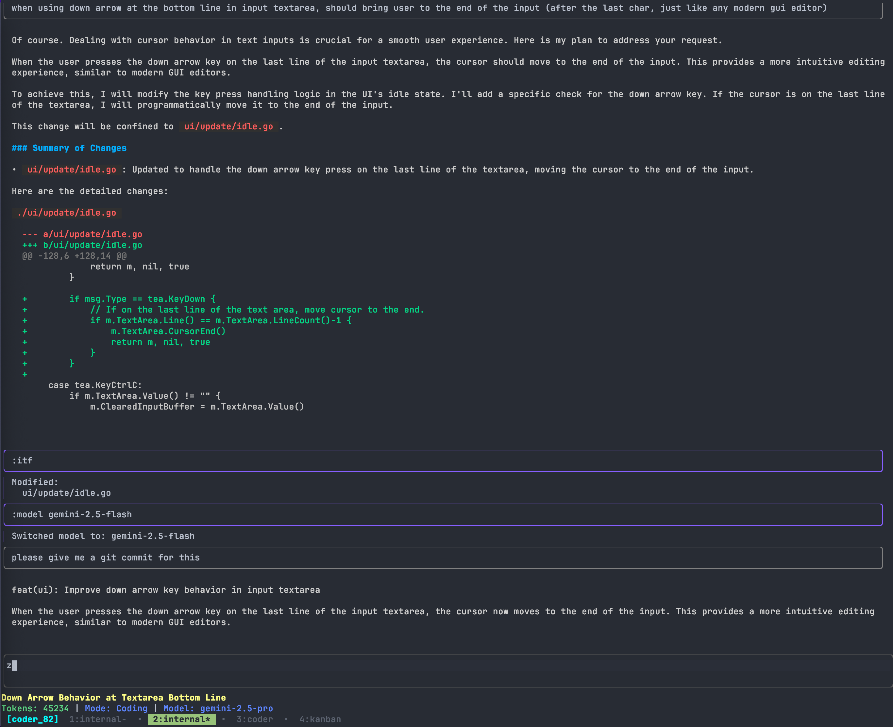
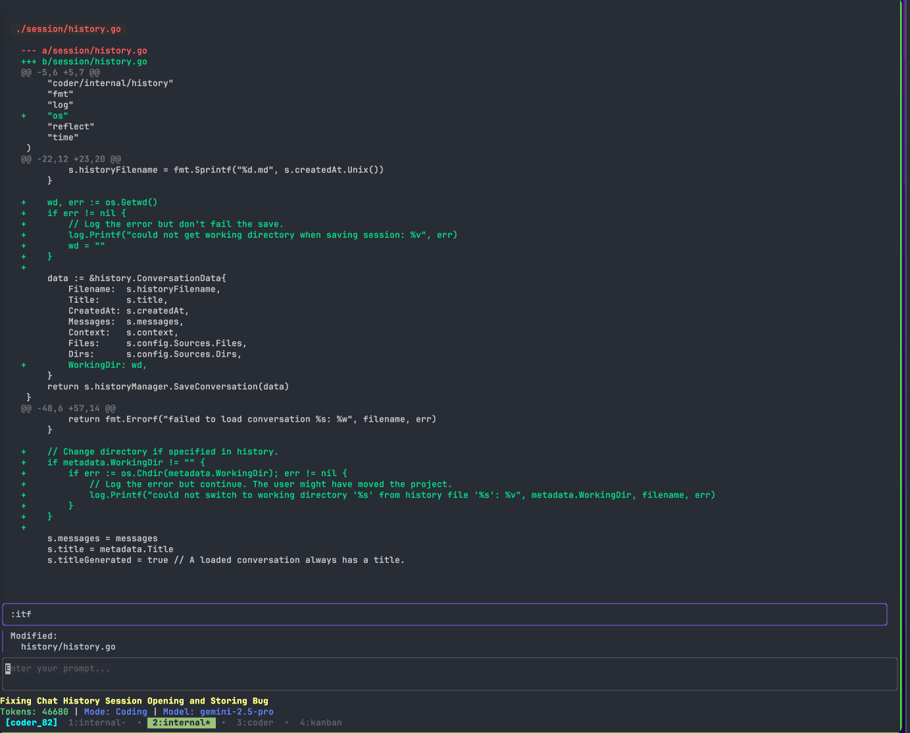
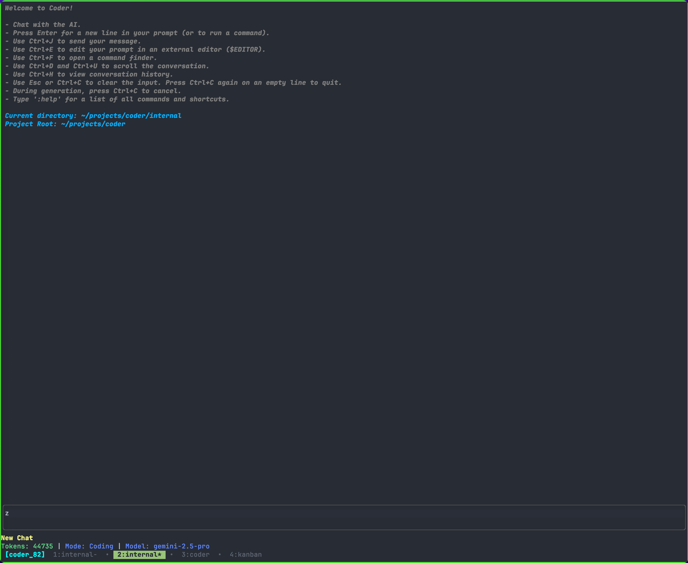

# Coder

A simple one-step AI code editor

## Quick Start

### Prerequisites

- **Common**: Go, Git.
- `pngpaste` (macOS) or `xclip` (Linux) or `wl-clipboard` (Linux Wayland) or [`sync-clip` (sync clipboard for ssh)](https://github.com/sokinpui/sync-clip) for image pasting.
- `synapse` server for LLM API proxy service. You can download here: [synapse](https://github.com/sokinpui/synapse.go)

### Installation

```sh
go install github.com/sokinpui/coder/cmd/coder@latest
```

### Usage

Run this command in your terminal

```sh
coder
```

## Configuration

On first run, a default `config.yaml` is created at `~/.config/coder/config.yaml`.

You can also create a project-specific configuration at `.coder/config.yaml` in your repository's root. This will override the global settings.

## Documentation

Full documentation for the project can be found in the `docs/` directory.

- **[Usage](./docs/Usage/README.md)**: How to configure and use the TUI.
- **[Architecture](./docs/Architecture/README.md)**: An overview of the project's architecture.
- **[Developer Guide](./docs/Develop/README.md)**: Information for contributors.

## Screenshot




